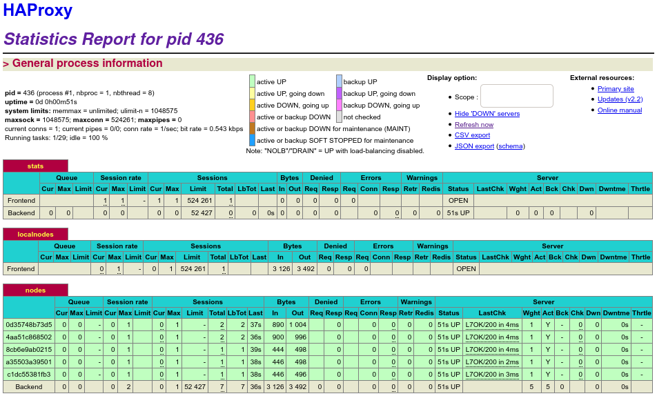
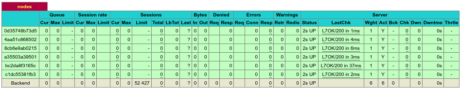
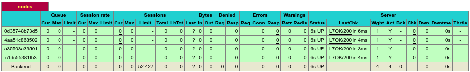

## AIT Lab 04 - Docker

**Author:** Müller Robin, Stéphane Teixeira Carvalho, Massaoudi Walid  
**Date:** 2020-01-06

### Introduction

In this laboratory, we will configure a load-balancer with dynamic scaling of servers. The goal of this lab is to become familiar with lightweight process supervision for Docker, understanding the concepts of dynamic scaling and make a decentralized management of web server instances.

In this report you will find the answers to the different questions and the difficulties encountered throughout the laboratory.

### Table of content
1. [Task 0 : Identify issues and install the tools](#task_0)
2. [Task 1 : Add a process supervisor to run several processes](#task_1)
3. [Task 2: Add a tool to manage membership in the web server cluster](#task_2)
4. [Task 3: React to membership changes](#task_3)
5. [Task 4: Use a template engine to easily generate configuration files](#task_4)
6. [Task 5: Generate a new load balancer configuration when membership changes](#task_5)
7. [Task 6: Make the load balancer automatically reload the new configuration](#task_6)
8. [Difficulties](#difficulties)

<a name="task_0"></a>
### Task 0 : Identify issues and install the tools
#### M1 : Do you think we can use the current solution for a production environment? What are the main problems when deploying it in a production environment?
The main problem is that we will use the same amount of servers every time of the year. For instance, we could have something more intelligent that will create a new server when we have a lot of incoming requests and shut down some servers when there is not much work to do. Currently, all the servers in the infrastructure are static and we have defined the amount of servers desired, two s1 and s2.

If we take the same example as shown in the lab with Galaxus with the Balck friday we will have 2 servers that will be not enough for the amount of connection that we will have and in the next week maybe one servers will be enough to handle all the requests but we will have two servers running.

#### M2 : Describe what you need to do to add new webapp container to the infrastructure. Give the exact steps of what you have to do without modifiying the way the things are done.
To add a new container, first, we will have to go in the docker compose file and add the following lines for the `webapp3`, and add a new environment variable to the `haproxy`:
```
webapp3:
       container_name: ${WEBAPP_3_NAME}
       build:
         context: ./webapp
         dockerfile: Dockerfile
       networks:
         heig:
           ipv4_address: ${WEBAPP_3_IP}
       ports:
         - "4002:3000"
       environment:
            - TAG=${WEBAPP_3_NAME}
            - SERVER_IP=${WEBAPP_3_IP}
haproxy:
       container_name: ha
       build:
         context: ./ha
         dockerfile: Dockerfile
       ports:
         - 80:80
         - 1936:1936
         - 9999:9999
       expose:
         - 80
         - 1936
         - 9999
       networks:
         heig:
           ipv4_address: ${HA_PROXY_IP}
       environment:
            - WEBAPP_1_IP=${WEBAPP_1_IP}
            - WEBAPP_2_IP=${WEBAPP_2_IP}
            - WEBAPP_3_IP=${WEBAPP_3_IP}
```

Then we have to add the following lines in the `.env` file environment :
```
...
WEBAPP_3_NAME=s3
...
WEBAPP_3_IP=192.168.42.33
...
```

And then in the haproxy configuration file we add a new variable for the new server :
```
# Define the list of nodes to be in the balancing mechanism
# http://cbonte.github.io/haproxy-dconv/2.2/configuration.html#4-server
server s1 ${WEBAPP_1_IP}:3000 check
server s2 ${WEBAPP_2_IP}:3000 check
server s3 ${WEBAPP_3_IP}:3000 check
```

As we can see it takes a lot of work to add a new server and with the current configuration we have to shutdown the haproxy and restart it to change the configuration file and have a third server.

#### M3 : Based on your previous answers, you have detected some issues in the current solution. Now propose a better approach at a high level.
As shown in the previous answer, the configuration of a new node is relatively long. A better approach would be to use a script to create a new container when necessary and update the load-balancer to add the new server in the network. We could think of a script that will automatically repeat the steps above or use a service that can do that for us.

#### M4 : You probably noticed that the list of web application nodes is hardcoded in the load balancer configuration. How can we manage the web app nodes in a more dynamic fashion?

We could think, as discussed in the previous question, of an application or service that will handle the new hosts and send a message when they are deployed or the fact that they are leaving, to the load-balancer. With that we could change the configuration file of the haproxy dynamically and restart it to handle the new configuration and the new server.  

#### M5 : Do you think our current solution is able to run additional management processes beside the main web server / load balancer process in a container? If no, what is missing / required to reach the goal? If yes, how to proceed to run for example a log forwarding process?
No, the current solution does not allow a container to handle multiple processes. This is because Docker has defined that a container is a process, hence only one process can be run by a container.

To reach the goal of running multiple processes we can add a process supervisor to the container. This will handle multiple processes inside a container and with that we can define which process could kill the container if it fails or those that do not kill the container. Later in the lab, you will see a process supervisor named `S6`.

#### M6 : What happens if we add more web server nodes? Do you think it is really dynamic? It's far away from being a dynamic configuration. Can you propose a solution to solve this?
In the current configuration when we add a new node nothing happens the HAproxy does not add the server to his configuration file. For that we have to do the steps shoed in the response of the question `M3`. It would be create to make this steps automatically.

We could think of a solution where we use a template for a node and use a script to change the configuration of the haproxy container directly and restart the haproxy when a new node is detected in the cluster.

#### 0.1


On the screenshot shown above we can see the 2 nodes that were started s1 and s2 so the infrastructure is working.

#### 0.2
Here is our URL :
https://github.com/Naludrag/Teaching-HEIGVD-AIT-2020-Labo-Docker

<a name="task_1"></a>
### Task 1 : Add a process supervisor to run several processes

#### 1.1


We can see that this task has been done successfully. The 2 nodes are still visible and the haproxy accessible.

#### 1.2
In this task we installed a init system to be able to execute multiple process in a docker container. The basic idea of Docker is to run one process per container but with S6 we can manage and supervise multiple processes in a container. With S6 we can choose which process to restart and we can prevent our container from dying if the main process die for instance. We could also choose which process, if it fails, shuts down the container.  
With this service we do not have "one process per container" but more "one thing per container".

Docker containers have to run a foreground process to be kept alive. And so, S6 will run as the foreground process and let the other processes run as background processes. With that, if a process fails the container will not die.

In our laboratory, it will be interesting to have such a tool because we could restart the haproxy process to have it update the init script to add new servers.

<a name="task_2"></a>
### Task 2 : Add a tool to manage membership in the web server cluster

#### 2.1
All the logs for this point are in the folder logs but here is the link to the files:
- [HAProxy](../logs/task%202/ha.log)
- [S1](../logs/task%202/s1.log)
- [S2](../logs/task%202/s2.log)

#### 2.2
In the current solution we could have a problem because all the nodes have to be registered through the HAProxy. Because of that, if the HAProxy is not up new machines could not join the cluster and that is not what the Serf mind set is for.

The Serf mind set is to join a cluster through multiple machines and not only one.

#### 2.3
The Serf agent will try to join the cluster trough the load-balancer. If the cluster is not created, it will create it and in reverse if it exists, it will join it. This step will only succeed if the ha container is accessible, otherwise the startup of the Serf agent will fail.

If a new node has joined the cluster or if it leave the cluster, Serf will use the `GOSSIP` protocol to tell other nodes about this information. This protocol is based on SWIM protocol and serf sends custom messages types on top of this layer. Two messages in particular are often used :
- Join Intent :  This message is sent to tell the nodes that a new machine is now in the cluster.
- Leave Intent : This message is sent when a server gracefully exit the cluster. If a server fails, no Leave Intent is sent and so with this message the Serf layer can know if a server has stopped gracefully or not.

This messages are always sent with a Lamport clock to maintain some notion of messages ordering.

If we want to find other solutions than Serf we could use for instance ZooKeeper or doozerd. But in some cases this solutions can be less interesting as for instance ZooKeeper. ZooKeeper cannot be used as a tool and a lot of the times developers have to use libraries to build features that they need.

<a name="task_3"></a>
### Task 3 : React to membership changes

#### 3.1
Here are the logs for this step :
- [HAProxy](../logs/task%203/ha.log)
- [S1](../logs/task%203/s1.log)
- [S2](../logs/task%203/s2.log)
- [HAProxy with nodes](../logs/task%203/ha_nodes.log)

#### 3.2
The logs of the serf.log file can be seen with the link below:
- [HAProxy](../logs/task%203/serf.log)

<a name="task_4"></a>
### Task 4: Use a template engine to easily generate configuration files

#### 4.1
The size of the container is the key for our docker engine performance. So how docker really build images and run multiple containers over it?
Let's say that we have a Dockerfile that contains three instructions :
```bash
From ...
Copy ...
Run ...
```
By running the ``` docker build ``` command, each of which creates a layer. Those layers are stacked on top of each other.  The final image contains only three layers in read-only mode.
when we create a new container by executing the command ```docker run``` using the previous image, a thin writable container layer is added to allows read and write operations.
Now, we give you another example, suppose that we have two Dokerfile contains the following instructions :

Dockerfile (1):
```bash
RUN command 1
RUN command 2
RUN command 3
```
Dockerfile (2):
```bash
RUN command 1 && command 2 && command 3
```
As we explained previously the first Dockerfile will produce an image with three layers. On other hand, the second Dockerfile will give us an image with one layer , which is obviously lighter than the first one.
But what happens if we run multiple containers ?.
Remember each container has its own writable container layer, and all changes are stored in this layer. So many container can share the same image layer. If any container needs a file that exists in a lower layer within the image, docker uses a copy-on-write strategy that allows the container to copy the target file into his own writable layer.
The good point about the presented mechanism is that we save a lot of disk space, but the copy-on-write strategy reduces start-up time.

##### Other techniques:
###### Image squashing:

Many tools (docker-squash) allows organizing the image in logical layers. So we can control the structure of the image and avoid unnecessary layers.
Sources :
   *  [Docker Squashing from PyPi](https://pypi.org/project/docker-squash/)
   *  [Squashing using Small Base Images ](http://jasonwilder.com/blog/2014/08/19/squashing-docker-images/)
###### Container flattening :

The fact that a docker container can be exported and imported back again, allow us to flatten a Docker container. The result will be much smaller because this technique will not preserve the history of the container.
Sources:
   *  [Flatten a Docker container](https://tuhrig.de/flatten-a-docker-container-or-image/)

#### 4.2
The idea to reduce the size of our images is to start from a base image that contains the most shared layers between those images. So each image will add only the necessary layer to the previous base image. In this project, we can build a base image to be used by all the web apps and the HAProxy by adding more layers.

#### 4.3
The /tmp/haproxy.cfg generated file :
- [ha](../logs/task%204/haproxy_ha.cfg)
- [s1](../logs/task%204/haproxy_s1.cfg)
- [s2](../logs/task%204/haproxy_s2.cfg)

Docker ps :
- [Docker ps](../logs/task%204/Docker_ps.log)

Docker inspect:
- [ha](../logs/task%204/Docker_insp_ha.log)
- [s1](../logs/task%204/Docker_insp_s1.log)
- [s2](../logs/task%204/Docker_insp_s2.log)

#### 4.4
The containers use an overlay2 storage driver. When an existing file in a container is modified, the storage driver performs a copy-on-write operation. For this reason, every container use many new or repetitive layer which will increase the used disk space. We can solve this by performing one of the previously discussed strategies like squashing or flattening.

<a name="task_5"></a>
### Task 5 : Generate a new load balancer configuration when membership changes

#### 5.1
Here are the config files for the different steps :
- [No nodes](../logs/task%205/haproxy_nonodes.cfg)
- [Only s1](../logs/task%205/haproxy_onlys1.cfg)
- [All the nodes](../logs/task%205/haproxy_nodes.cfg)

Here are the files for the `docker inspect` :
- [HA inspect](../logs/task%205/docker_inspect_ha.log)
- [S1 inspect](../logs/task%205/docker_inspect_s1.log)
- [S2 inspect](../logs/task%205/docker_inspect_s2.log)

And here is the link to the `docker ps` command :
- [Docker ps](../logs/task%205/docker_ps.log)

#### 5.2
Here is the log file for the `/nodes` folder :
- [Node Folder](../logs/task%205/nodes_folder.log)

#### 5.3
Here is the log file for the `/nodes` folder :
- [HA inspect](../logs/task%205/nodes_folder_without_s1.log)

Here is the result of the configuration file :
- [Config file without s1](../logs/task%205/haproxy_without_s1.cfg)

Finally, here is the output of the `docker ps` command :
- [Config file without s1](../logs/task%205/docker_ps_without_s1.log)

<a name="task_6"></a>
### Task 6 : Make the load balancer automatically reload the new configuration

#### 6.1
We started the HAProxy container with 5 webapp containers:  


The `docker ps` logs can be found [here](../logs/task%206/docker_ps_1.log).

After starting a new webapp container, we can see that we now have 6 nodes:  


The `docker ps` logs can be found [here](../logs/task%206/docker_ps_2.log).

After removing the s6 and s5 containers, we have the following result:  


The `docker ps` logs can be found [here](../logs/task%206/docker_ps_3.log).

#### 6.2
We think that the solution used in this labo is pretty good, during our testing we didn't even feel the downtime when adding a new container on a web browser. We did feel it when removing containers, but that is due to the proxy not removing it immediately, not the reload in itself.

The most logical improvement to this solution would be to achieve a zero downtime configuration update, this would prove quite useful in a high traffic environment.  

<a name="difficulties"></a>
### Difficulties
In the end, no difficulties were present throughout the laboratory. So we did not have something to write in this section.

### Conclusion
To conclude, we found this laboratory interesting because we could practice the theory seen in the course. It was also interesting to see new technologies such as Serf, s6 and Handlebars and understanding their utility in our lab and in other places.

It was great to see the application becoming more and more dynamic after every task.

Finally, we are happy with the result that we have and we think that we completed the laboratory successfully.
