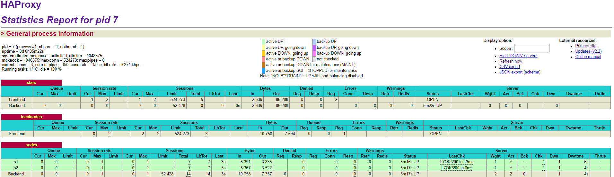
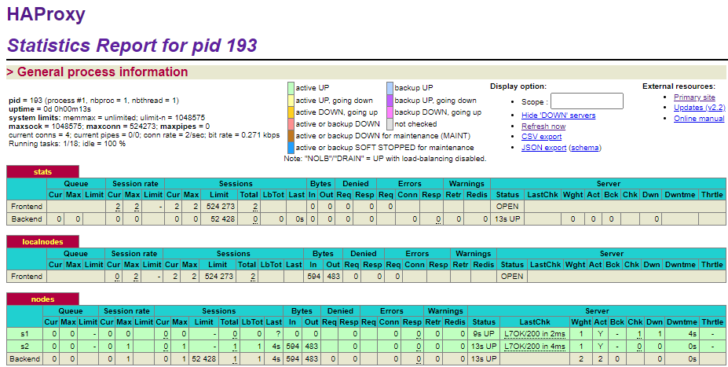

## AIT Lab 04 - Docker

**Author:** Müller Robin, Stéphane Teixeira Carvalho, Massaoudi Walid  
**Date:** 2020-12-02

### Introduction

In this laboratory, we will configure a load-balancer with different configuration like sticky sessions or drain mode. We will also look at the results with the different modifications. We will also look at what happens when a server is lower than another. At the end, we will look at two new algorithms to choose a node and compare them by showing results and choose the most suitable for the laboratory.


### Task 0 : Identify issues and install the tools
#### M1 : Do you think we can use the current solution for a production environment? What are the main problems when deploying it in a production environment?
The main problem will be that we will use the same amount of servers every time of the year. For instance, we could have something more intelligent that will create a new server when we have a lot of incoming requests and shut down some servers when there is not much work to do.

#### M2 : Describe what you need to do to add new webapp container to the infrastructure. Give the exact steps of what you have to do without modifiying the way the things are done.
To add a new container, first, we will have to go in the docker compose file and add the following lines :
```
webapp3:
       container_name: ${WEBAPP_3_NAME}
       build:
         context: ./webapp
         dockerfile: Dockerfile
       networks:
         heig:
           ipv4_address: ${WEBAPP_3_IP}
       ports:
         - "4002:3000"
       environment:
            - TAG=${WEBAPP_3_NAME}
            - SERVER_IP=${WEBAPP_3_IP}
haproxy:
       container_name: ha
       build:
         context: ./ha
         dockerfile: Dockerfile
       ports:
         - 80:80
         - 1936:1936
         - 9999:9999
       expose:
         - 80
         - 1936
         - 9999
       networks:
         heig:
           ipv4_address: ${HA_PROXY_IP}
       environment:
            - WEBAPP_1_IP=${WEBAPP_1_IP}
            - WEBAPP_2_IP=${WEBAPP_2_IP}
            - WEBAPP_3_IP=${WEBAPP_3_IP}
```

And then in the haproxy file :

```
# Define the list of nodes to be in the balancing mechanism
# http://cbonte.github.io/haproxy-dconv/2.2/configuration.html#4-server
server s1 ${WEBAPP_1_IP}:3000 check
server s2 ${WEBAPP_2_IP}:3000 check
server s3 ${WEBAPP_3_IP}:3000 check
```

#### M3 : Based on your previous answers, you have detected some issues in the current solution. Now propose a better approach at a high level.
A better approach will be to use a script to create a new container when necessary and update the load-balancer to add the new server in the network.

#### M4 : You probably noticed that the list of web application nodes is hardcoded in the load balancer configuration. How can we manage the web app nodes in a more dynamic fashion?

#### M5 : Do you think our current solution is able to run additional management processes beside the main web server / load balancer process in a container? If no, what is missing / required to reach the goal? If yes, how to proceed to run for example a log forwarding process?

#### M6 : What happens if we add more web server nodes? Do you think it is really dynamic? It's far away from being a dynamic configuration. Can you propose a solution to solve this?


#### 0.1


#### 0.2
Here is our URL :
https://github.com/Naludrag/Teaching-HEIGVD-AIT-2020-Labo-Docker

### Task 1 : Identify issues and install the tools

#### 1.1


We can see that this task has been done successfully.

#### 1.2
In this task we installed a init system to be able to execute multiple process in a docker container. The basic idea of Docker is to run one process per container but with S6 we can manage and supervise multiple processes. With S6 we can choose which process to restart to never let a container die. We could also choose which process if they die shut down the container.
With this service we do not have "one process per container" but more "one thing per container".

Docker containers have to run a foreground process to be kept alive. And so, S6 will run as the foreground process and let teh other processes run as background process. With that, if a process fail the container will not die.

In our laboratory it will be interesting to have such a tool because we could restart the haproxy process to have the update the init script to add new servers.

### Task 2 : Add a tool to manage membership in the web server cluster

#### 2.1
All the logs for this point are in the folder logs but here is the link to the files :
- [HAProxy](./logs/task%202/ha.log)
- [S1](./logs/task%202/s1.log)
- [S2](./logs/task%202/s2.log)

#### 2.2
In the current solution we could have a problem because all the nodes have to be registered through the HAProxy. Because of that, if the HAProxy is not up new machines could not join the cluster and that is not what the Serf mind set is for.

The Serf mind set is to join a cluster through multiple machines and not only one.

#### 2.3
The Serf agent will try to join the cluster trough the load-balancer. If the cluster is not created it will create it and in reverse if it exists it will join it. But this step will only succeed if the ha container is accessible if not the startup of the Serf agent will fail.

If a new node has joined the cluster or if it leave the cluster, Serf will use the gossip protocol to tell other nodes that about this information. This protocol is based on SWIM protocol and serf sends custom messages types on top of this layer. Two messages in particular are often used :
- Join Intent :  This message is sent to tell the nodes that a new machine is now in the cluster.
- Leave Intent : This message is sent when a server gracefully exit the cluster. If a server fail no Leave Intent is sent and so with this message the Serf layer can know if a server has stopped gracefully or not.

This messages are always sent with a Lamport clock to maintain some notion of messages ordering.

If we want to find other solutions than Serf we could use for instance ZooKeeper or doozerd. But in some cases this solutions can be less interesting as for instance ZooKeeper. ZooKeeper cannot be used as a tool and a lot of the times developers have to use libraries to build features that the need.

### Task 3 : React to membership changes

#### 3.1
Here are the logs for this step :
- [HAProxy](./logs/task%203/ha.log)
- [S1](./logs/task%203/s1.log)
- [S2](./logs/task%203/s2.log)
- [HAProxy with nodes](./logs/task%203/ha_nodes.log)

#### 3.2
The logs of the serf.log file can be seen with the link below:
- [HAProxy](./logs/task%203/serf.log)

### Difficulties
#### Task 1
In this task no difficulties were encountered.

#### Task 2
In this task no difficulties were encountered.

#### Task 3
In this task no difficulties were encountered.

### Conclusion
To conclude, we found this laboratory interesting because we could practice the theory seen in the course. It was also interesting to see what can happen if a load-balancer has a slower server or if the session stickiness is not enabled. Seeing multiple balancing strategies and to choose between them is also an interesting point in the laboratory.

Finally, we are happy with the result that we have and we think that we completed the laboratory successfully.
